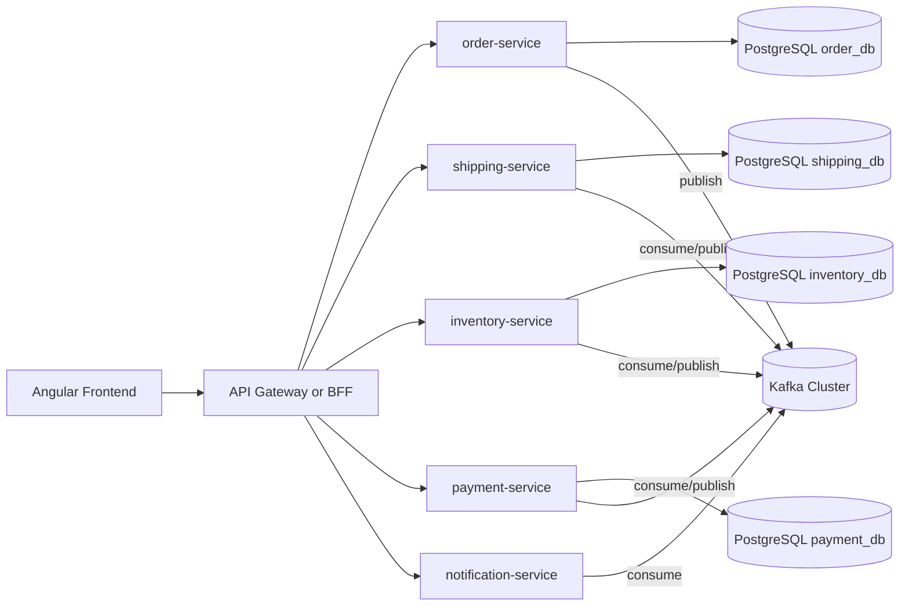

# E-commerce Event Driven Architecture

Proyecto de portafolio profesional para demostrar una plataforma de e-commerce basada en microservicios, arquitectura hexagonal y comunicacion asincrona con Kafka.

## Vision del proyecto

Este repositorio muestra un enfoque real de arquitectura moderna para backend y frontend:

- Microservicios desacoplados para dominios de negocio.
- Contratos primero (API y eventos) para minimizar ambiguedad.
- Comunicacion REST para consultas/comandos directos y Kafka para integracion entre servicios.
- Modelo evolutivo pensado para CI/CD, observabilidad y crecimiento del dominio.

## Objetivo de portafolio

El objetivo no es solo que "funcione", sino demostrar buenas practicas de nivel profesional:

- Diseño con Hexagonal Architecture (domain, application, ports, adapters).
- Contratos versionados en docs/contracts.
- Trazabilidad de cambios por epicas y subtareas Jira.
- Convenciones de calidad para compilar, testear y documentar cada entrega.

## Arquitectura de alto nivel



## Stack tecnologico

- Java 17
- Spring Boot 3.5.x
- Maven
- Spring Data JPA
- PostgreSQL
- Apache Kafka
- Docker + Docker Compose
- Spring Security + JWT (en roadmap de implementacion)
- Angular 17+ + Tailwind (frontend en roadmap)

## Estado actual

- Servicio principal activo: order-service.
- Estructura hexagonal base implementada.
- Capa REST inicial implementada para ordenes.
- Contratos de API y eventos definidos en v1.

## Contratos oficiales

- [Contrato OpenAPI v1 - order-service](docs/contracts/order-service-openapi-v1.yaml)
- [Contrato de eventos Kafka v1](docs/contracts/kafka-events-v1.md)

## Entregables Jira (KAN-22 a KAN-25)

- [KAN-22 - OpenAPI v1](docs/kan/KAN-22-openapi-v1.md)
- [KAN-23 - Contrato Kafka v1](docs/kan/KAN-23-kafka-contract-v1.md)
- [KAN-24 - Observabilidad minima](docs/kan/KAN-24-observabilidad-minima.md)
- [KAN-25 - Resiliencia retry y DLQ](docs/kan/KAN-25-resiliencia-retry-dlq.md)

## Estructura de codigo (order-service)

```text
order-service/src/main/java/com/ecommerce/order/
|- adapter/
|  |- in/
|  |  |- controller/
|  |- out/
|     |- persistence/
|- application/
|- domain/
|- ports/
```

## Principios de integracion entre microservicios

- REST para operaciones sincronas orientadas a cliente.
- Kafka para eventos de dominio y coordinacion eventual.
- Cada servicio es duenio de su propia base de datos.
- Los consumidores de eventos deben ser idempotentes.
- Versionado explicito de contratos para evolucion segura.

## Ejecutar localmente

### 1. Levantar infraestructura

Desde la raiz del repositorio:

```bash
docker compose up -d
```

### 2. Ejecutar el servicio

```bash
cd order-service
./mvnw spring-boot:run
```

En Windows PowerShell:

```powershell
Set-Location order-service
.\mvnw.cmd spring-boot:run
```

### 3. Validar compilacion y tests

```bash
./mvnw clean test
```

## Flujo profesional de trabajo (Jira + Git)

1. Definir alcance de subtarea con criterio de aceptacion claro.
2. Implementar solo el alcance comprometido.
3. Validar compile y tests.
4. Actualizar subtarea Jira con evidencia tecnica.
5. Realizar commit con mensaje orientado a resultado.
6. Push a develop al cerrar un bloque funcional completo.

## Ejemplos de commits

- feat(order-service): implement order REST adapter and use case wiring
- feat(contracts): add OpenAPI and Kafka event contracts v1
- docs(readme): describe architecture, roadmap and delivery workflow

## Roadmap propuesto

1. Endurecer seguridad JWT y autorizacion por rol.
2. Publicacion de eventos de orden en Kafka.
3. Consumidores en shipping/inventory/payment.
4. Implementar patron outbox para entrega confiable de eventos.
5. Agregar observabilidad (logs estructurados, metricas, tracing).
6. Construir frontend Angular conectado por contratos.

## Valor para reclutadores y clientes

Este repositorio esta orientado a demostrar capacidad real en:

- Diseño de sistemas distribuidos.
- Implementacion backend moderna con Java/Spring.
- Integracion event-driven con Kafka.
- Practicas profesionales de documentacion y entrega incremental.
