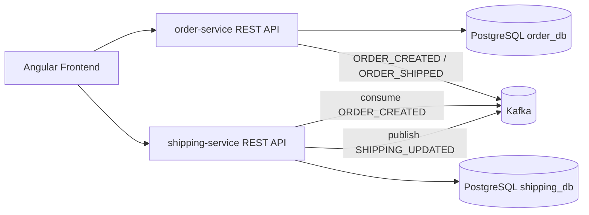
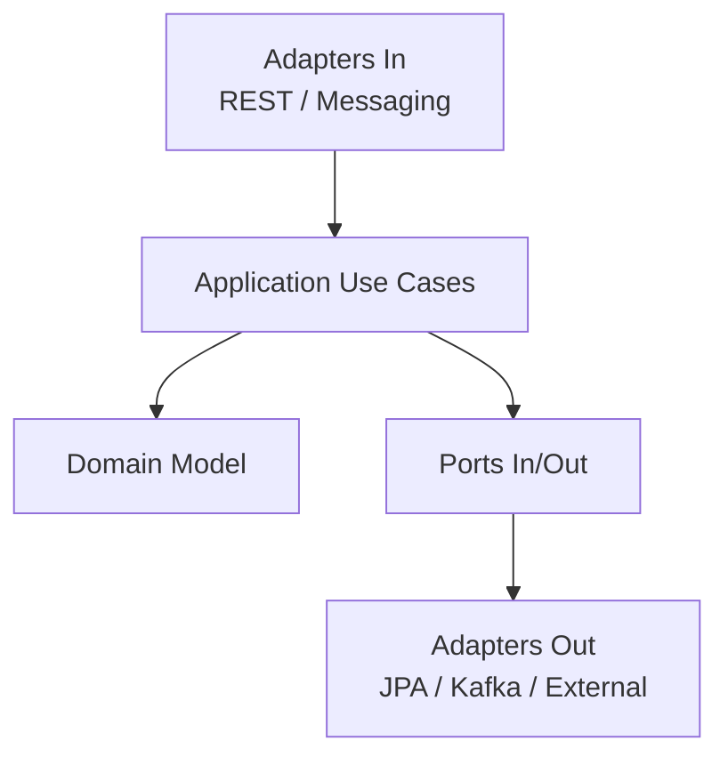
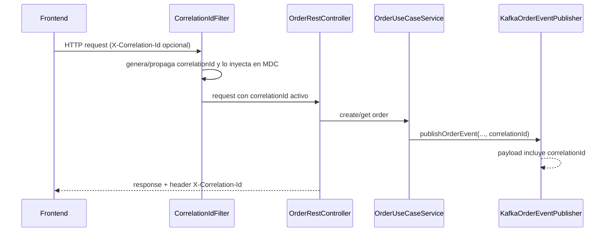

# E-commerce Event Driven Architecture

Proyecto de portafolio orientado a demostrar una solucion de e-commerce moderna con microservicios, arquitectura hexagonal, integracion asincrona con Kafka y frontend Angular corporativo.

## Resumen ejecutivo

El repositorio implementa un flujo realista de negocio:

- Gestion de ordenes en `order-service`.
- Orquestacion logistica en `shipping-service`.
- Contratos API/Eventos versionados como fuente de verdad.
- Frontend Angular con autenticacion JWT, carrito, checkout y seguimiento asincrono.

Este enfoque prioriza escalabilidad, trazabilidad y calidad continua, con entregas incrementalmente evidenciadas en Jira.

## Arquitectura de solucion



## Capas por servicio (hexagonal)



## Trazabilidad CorrelationId (KAN-40)



## Stack tecnologico

- Backend: Java 17, Spring Boot 3.5.x, Spring Security, Maven, JPA, PostgreSQL.
- Integracion: Apache Kafka, contratos de eventos versionados.
- Frontend: Angular 17 standalone, TailwindCSS, SCSS, Jasmine + Karma.
- Infra local: Docker Compose.
- Calidad: pruebas unitarias/integracion, convenciones de commits y evidencia por KAN.

## Alcance funcional implementado

### Backend

- API de ordenes con contrato OpenAPI v1.
- Publicacion y consumo de eventos Kafka v1.
- Seguridad base + soporte Swagger en `order-service`.
- Resiliencia inicial con mecanismos de retry y DLQ.

### Frontend (Epic 4)

- KAN-18: bootstrap Angular + Tailwind + shell.
- KAN-19 y KAN-30: autenticacion JWT, guard, interceptores y modelo de errores HTTP.
- KAN-20: catalogo, carrito y checkout conectado a backend.
- KAN-31: ciclo E2E de autenticacion con gestion de eventos de sesion.
- KAN-32: seguimiento de pedido con actualizacion asincrona y estados de UX.

## Contratos oficiales

- [Contrato OpenAPI v1 - order-service](docs/contracts/order-service-openapi-v1.yaml)
- [Contrato de eventos Kafka v1](docs/contracts/kafka-events-v1.md)
- [Versionado de contratos](docs/contracts/VERSIONING.md)
- [Changelog de contratos](docs/contracts/CHANGELOG.md)

## Entregables Jira

- [Indice completo de KAN](docs/kan/README.md)
- [Matriz de trazabilidad Jira-GitHub](docs/portfolio/traceability-matrix.md)

## Artefactos de arquitectura y portfolio

- [README de order-service](order-service/README.md)
- [ADR-001 Hexagonal + Event-Driven](docs/adr/ADR-001-hexagonal-event-driven-order-service.md)
- [Matriz de trazabilidad Jira-GitHub](docs/portfolio/traceability-matrix.md)
- [Checklist de demo visual](docs/portfolio/demo-checklist.md)
- [Checklist de cierre final](docs/portfolio/project-closure-checklist.md)
- [Guia de limpieza de ramas](docs/portfolio/branch-cleanup.md)
- [Evidencia visual de Jira](docs/jira/README.md)
- [Coleccion Postman automatizada](docs/postman/README.md)

## Estructura de codigo

```text
frontend/
|- src/app/core            # auth, http, layout, guards, interceptors
|- src/app/features        # auth, catalog, cart, checkout, tracking
|- src/app/shared          # componentes compartidos

order-service/src/main/java/com/ecommerce/order/
|- adapter/                # entrada REST, salida JPA/Kafka
|- application/            # casos de uso
|- domain/                 # entidades y reglas de negocio
|- ports/                  # contratos in/out

shipping-service/src/main/java/com/ecommerce/shipping/
|- adapter/
|- application/
|- domain/
|- ports/
```

## Calidad y pruebas

### Backend

- Ejecutar pruebas en cada servicio:

```bash
cd order-service
./mvnw clean test
```

```bash
cd shipping-service
./mvnw clean test
```

### Frontend

- Build de validacion:

```bash
cd frontend
npm run build
```

- Suite unitaria:

```bash
cd frontend
npm run test -- --watch=false --browsers=ChromeHeadless --progress=false
```

## CI y quality gates

- Pipeline GitHub Actions en [.github/workflows/ci.yml](.github/workflows/ci.yml).
- Build y test automatizados para `order-service`, `shipping-service` y `frontend`.
- Umbral minimo de cobertura frontend aplicado en CI.
- Cobertura minima backend aplicada via JaCoCo en ambos servicios.
- Baseline inicial de cobertura: 30% para evitar que la calidad minima se degrade mientras se sigue ampliando la suite.

## Ejecutar localmente

### 1. Levantar infraestructura

Desde la raiz del repositorio:

```bash
docker compose up -d
```

### 2. Ejecutar order-service

```bash
cd order-service
./mvnw spring-boot:run
```

En Windows PowerShell:

```powershell
Set-Location order-service
.\mvnw.cmd spring-boot:run
```

### 3. Ejecutar shipping-service

```bash
cd shipping-service
./mvnw spring-boot:run
```

En Windows PowerShell:

```powershell
Set-Location shipping-service
.\mvnw.cmd spring-boot:run
```

### 4. Ejecutar frontend

```bash
cd frontend
npm install
npm start
```

En Windows con restriccion de scripts PowerShell, usar:

```powershell
cmd /c npm install
cmd /c npm start
```

## Flujo de trabajo

1. Definir alcance de subtarea con criterio de aceptacion.
2. Implementar en bloques pequenos y trazables.
3. Validar build y tests antes de cerrar cada bloque.
4. Actualizar evidencia tecnica en la KAN correspondiente.
5. Confirmar cambios con mensaje de commit orientado a resultado.
6. Integrar en rama principal de desarrollo.

## Ejemplos de commits

- feat(order-service): implement order REST adapter and use case wiring
- feat(shipping-service): bootstrap hexagonal module and local configuration
- feat(frontend): add catalog cart checkout and tracking flows
- test(frontend): add unit tests for cart and http response handling
- docs(readme): publish architecture and quality strategy for portfolio

## Roadmap tecnico

1. Expandir cobertura de tests frontend (interceptores, guard, tracking service).
2. Agregar pruebas E2E de punta a punta sobre flujo de compra.
3. Endurecer seguridad por rol y politicas de autorizacion.
4. Implementar outbox en publicacion de eventos criticos.
5. Incorporar observabilidad distribuida (metricas y trazas).

## Valor profesional

Este repositorio demuestra:

- Diseno y evolucion de sistemas distribuidos.
- Implementacion de microservicios con principios de arquitectura limpia.
- Integracion event-driven con contratos versionados.
- Ejecucion de un frontend moderno alineado a contrato backend.
- Disciplina de entrega profesional con evidencia, pruebas y documentacion.
