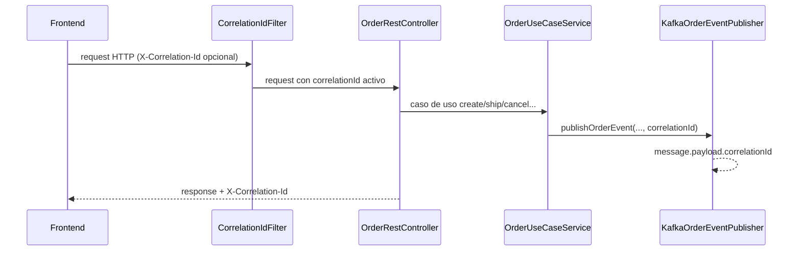

# order-service

Microservicio de gestion de ordenes para la plataforma e-commerce. Implementa casos de uso de creacion, consulta y postventa, con arquitectura hexagonal y publicacion de eventos de dominio en Kafka.

## Responsabilidades funcionales

- Crear ordenes (`POST /api/orders`).
- Consultar ordenes por id, numero de orden, tracking y cliente.
- Gestionar transiciones operativas (`ship`, `complete`, `cancel`, `return`, `refund`).
- Publicar eventos de negocio en topic Kafka versionado.
- Exponer endpoints operativos de actuator para salud y metricas.

## Arquitectura interna

```text
src/main/java/com/ecommerce/order/
|- adapter/
|  |- in/
|  |  |- controller/              # REST + DTOs + handlers
|  |  |- observability/           # CorrelationIdFilter + contexto
|  |  |- security/                # JWT, CORS y reglas de acceso
|  |- out/
|     |- persistence/             # JPA entities/repositories/adapters
|     |- messaging/               # publisher Kafka y contratos de evento
|- application/
|  |- service/                    # implementacion de casos de uso
|- domain/
|  |- model/                      # entidades de dominio
|- ports/
|  |- in/                         # interfaces de casos de uso
|  |- out/                        # interfaces de persistencia/eventos
```

## Endpoints clave

- Auth:
  - `POST /api/v1/auth/login`
- Orders:
  - `POST /api/orders`
  - `GET /api/orders/{id}`
  - `GET /api/orders/by-order-number/{orderNumber}`
  - `GET /api/orders/by-tracking-number/{trackingNumber}`
  - `GET /api/orders/customer/{customerId}`
  - `PATCH /api/orders/{id}/shipping-address`
  - `POST /api/orders/{id}/ship`
  - `POST /api/orders/{id}/complete`
  - `POST /api/orders/{id}/cancel`
  - `POST /api/orders/{id}/return`
  - `POST /api/orders/{id}/refund`
- Operacion:
  - `GET /actuator/health`
  - `GET /actuator/info`
  - `GET /actuator/metrics`

## Seguridad y observabilidad

- Seguridad JWT stateless.
- CORS para frontend local (4200 / 3000).
- Correlation ID propagado por header `X-Correlation-Id`.
- Logs JSON estructurados con `traceId` y `correlationId`.
- Respuestas de error incluyen `correlationId` para soporte.

## Flujo de trazabilidad (request a evento)



## Ejecucion local

### 1. Levantar infraestructura

Desde la raiz del repositorio:

```bash
docker compose up -d
```

### 2. Ejecutar servicio

```bash
cd order-service
./mvnw spring-boot:run
```

En Windows PowerShell:

```powershell
Set-Location order-service
.\mvnw.cmd spring-boot:run
```

## Validacion

```bash
cd order-service
./mvnw clean test
```

Salida esperada:
- `BUILD SUCCESS`
- suite de seguridad, correlation y use cases en verde.
